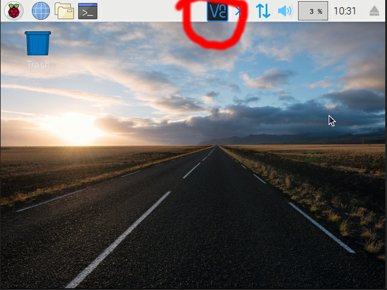

# Xnor Python Demo

In this directory are several samples using the Xnor Python language bindings.
These samples should serve to demonstrate how the API is intended to be used,
and inspire ideas for putting Xnor models to use in your project.

If you have any problems using the Xnor SDK, please submit questions and
feedback at [support.xnor.ai](https://support.xnor.ai)

## Getting Started

### OS
Please preload your Raspberry Pi 3 with [Raspbian Stretch with
Desktop](https://downloads.raspberrypi.org/raspbian_latest).  Other
distributions might also work but have not been tested.

### Install script

Each of these Python samples have different requirements; the combined
requirements of all samples in this directory are listed in `requirements.txt`.
You can install them all at once with the following commands (you may need to
run `chmod +x ./install_dependencies_rpi.sh` first).

    ../install_dependencies_rpi.sh

This will prompt you to reboot your device upon completion.

### Installing an Xnor model

To install an Xnor model, use the following command with any of the models in
the `lib/rpi3/` folder of this SDK:

    python3 -m pip install ../../../lib/rpi3/person-pet-vehicle-detector/xnornet-*.whl

To run any of the Python samples, you must have installed an Xnor model Python
wheel as above. The model task (last part of the name) should match the task
used by the sample; e.g. for object detection samples, install the wheel for a
detection model.  To run the classification samples, you must install an Xnor
Python wheel for a classification model. And so on, likewise, for the
segmentation samples.

## Directory Contents

 - `model_benchmark.py`: A benchmark that provides performance details for the
   current installed model.
 - `picamera_cli_object_detector.py`: Continuously prints out objects that are
   detected in the Pi camera's field of view.
 - `picamera_cli_surveillance.py`: A simplistic version of a home security
   system. Watches the video feed from the Pi camera until a person enters its
   field of view. Once a person is detected, saves an image of them to the SD
   card for later perusal.
 - `picamera_live_overlay_object_detector.py`: Displays a live video feed of the
   Pi camera, with an overlay showing the location of recognized objects in the
   scene.
   NOTE: The camera overlay is added via a low level interface, and can only
   be seen by connecting a monitor to the Raspberry Pi 3 or using a VNC Viewer
   (see [VNC access](#vnc-access) for more information).
 - `static_image_bounding_box.py`: A generic object detector that will draw
   rectangles around recognized objects in an image file.
 - `sort_images_into_directories.py`: A sample that will take an input
   directory with image files inside of it and move the image files into an
   output directory with subdirectories containing the image files sorted by
   classification.
 - `requirements.txt`: A list of Python packages that need to be installed for
   the samples to work.

## Switching out models

To change the active model, uninstall the current one, then `pip install` a
different Xnor model Python wheel as described in [Getting
Started](#getting-started).

    python3 -m pip uninstall xnornet
    python3 -m pip install --user ../../../lib/rpi3/facial-expression-classifier/xnornet*.whl

## VNC access

If you haven't already, you can enable SSH to access the Raspberry Pi 3 from
another device.

    sudo raspi-config
    Interfacing Options -> SSH    -> Enable

The following instructions detail how to set up VNC access to the Raspberry
Pi 3. This is useful, for example, to see the results of the live overlay sample
from another device.

First, enable the VNC server in the `raspi-config` utility.

    # Setup Interfaces
    sudo raspi-config
    Interfacing Options -> VNC    -> Enable

Then, force the desktop to start when the Raspberry Pi boots, even if no display
is connected.

    # Setup screen resolution
    # https://www.raspberrypi.org/documentation/configuration/config-txt/video.md
    # Force the desktop to start even without a desktop
    sudo sed -i s/\#hdmi_force_hotplug=1/hdmi_force_hotplug=1/g /boot/config.txt
    # Force the display resolution setup to be DMT group
    sudo sed -i s/\#hdmi_group=1/hdmi_group=2/g /boot/config.txt
    # Force the display resolution to be 1024x768 @ 60Hz
    sudo sed -i s/\#hdmi_mode=1/hdmi_mode=16/g /boot/config.txt

    # Make options valid and alive
    sudo reboot

### VNC direct capture

You can use VNC® Viewer for Google Chrome™ to connect the Raspberry Pi 3. Enable
the direct capture mode for VNC, so that we can visualize the low level
rendering by our samples.

To turn this feature on:

- On your Raspberry Pi, open the VNC Server dialog.

- Navigate to Menu > Options > Troubleshooting and select Enable experimental
  direct capture mode.

- On the device you'll use to take control, run VNC Viewer and connect.

  Note: existing connections must be restarted in order for these changes to
  take effect.

The VNC Server dialog is located as following circled in red:

NOTE: for `picamera_live_overlay_object_detector.py`, after the sample is
running, use `VNC® Viewer for Google Chrome™` to connect the rpi3. You will see
the bounding box with object label.

